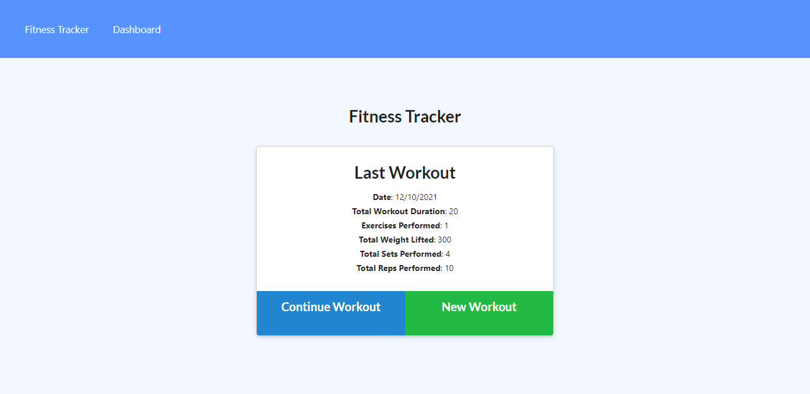
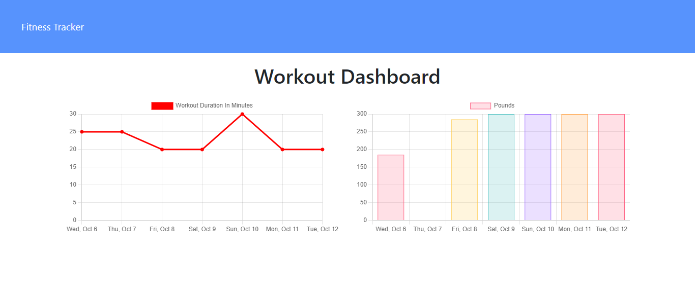

# Fitness Tracker

[](https://opensource.org/licenses/MIT)

## Description

This project a simple application used to track your workouts for a given period. It can be used to insert various types of workouts and the user can mark them as complete. Not only that, but also this application provides opportunity to view the statistics for the past 7 days in terms of time and duration.

This application is built using several technologies and tools. As languages **HTML, CSS and Javascript** are used. Apart from that **MongoDB, Node.js, Mongoosejs as Object Document Mapping (ODM) and Express server.** This application is deployed using **MongoDB Atlas and Heroku.**

## Table of Contents

- [Important Links](#Important-Links)
- [Mockup](#Mockup)
- [Installation](#Installation)
- [Usage](#Usage)
- [License](#License)
- [Contribute](#Contributing)
- [Questions](#Questions)

## Important Links

Following are the important links related to this application.

- [Fitness Tracker - Heroku Deployment](https://glacial-basin-20895.herokuapp.com/)
- [Fitness Tracker - Github Repo](https://github.com/vish-opatha/fitness-tracker)

## Mockup

_Homepage_



_Statistics Page_



## Installation

To install the necessary dependencies, run the following command:

```
npm install
```

## Usage

You can run the project by cloning this project to your local machine. You need to have MonogoDB Community Server installed in your local computer. To run the project locally, run the following command.

```
node server.js
```

After the above step go to the browser and access the application using localhost:3000

There are data that you could seed into the database if you prefer. For that, you could run the following command.

```
node seeders/seed.js
```

To use the deployed version, please see the deployed link given in the important links section.

## License

This project is licensed under the MIT license.

## Contributing

Any user can contribute this project by raising an issue in the github repository.

## Questions

If you have any questions about the repo, open an issue or directly contact me at <v.opatha@gmail.com> You can find my other work at [Github](https://github.com/vish-op)

[Heroku deployment](https://glacial-basin-20895.herokuapp.com/)
